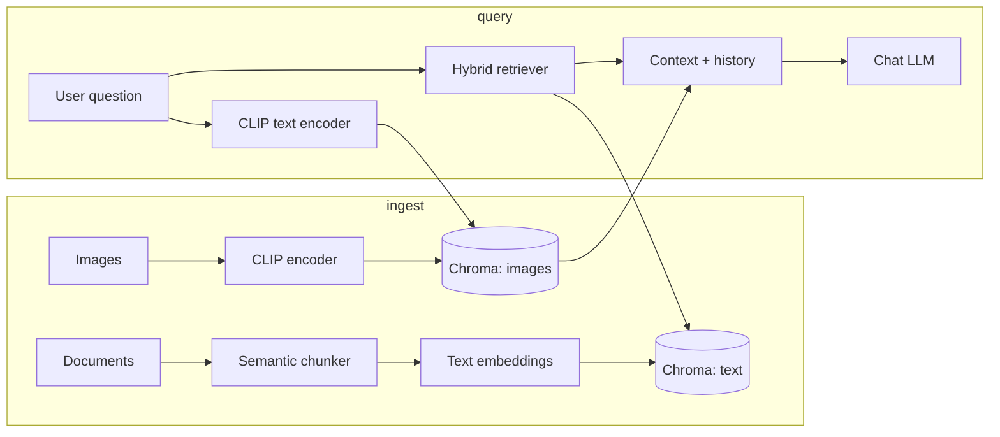

# Advanced multimodal RAG

End-to-end **ingest → chunk → embed → store → retrieve → generate** with:

- **Semantic chunking**: splits when *embedding similarity between adjacent sentences* drops (not character-based).
- **Hybrid retrieval**: weighted [Reciprocal Rank Fusion](https://plg.uwaterloo.ca/~gvcormac/cormacksigir09-rrf.pdf) over Chroma dense search + BM25 (toggle off for dense-only).
- **Optional multimodality**: images indexed with **CLIP** (separate Chroma collection); text queries can pull visually related images into the LLM context.
- **History-aware chat**: last *N* user/assistant turns are passed to the model with retrieval on the current question.
- **Streamlit UI**: upload PDF/TXT/MD + images, tune chunking and retrieval, inspect sources.

## Setup

```bash
python -m venv venv
venv\Scripts\activate   # Windows
pip install -r requirements.txt
```

Create `.env` in the project root (or set env vars):

```env
OPENAI_API_KEY=sk-...
# Optional overrides:
# OPENAI_MODEL=gpt-4o-mini
# EMBEDDING_MODEL=sentence-transformers/all-MiniLM-L6-v2
# CLIP_MODEL=clip-ViT-B-32
# VECTOR_DB_DIR=vectorstore/chroma
```

## Run the app

From the **repository root**, use the venv’s Python so `streamlit` resolves correctly:

**PowerShell (recommended on Windows):**

```powershell
.\venv\Scripts\python.exe -m streamlit run app/app.py
```

Or double‑click / run:

```powershell
.\run_app.ps1
```

**If the venv is activated** (`.\venv\Scripts\Activate.ps1`), then `streamlit run app/app.py` also works.

## CLI ingest (optional)

```bash
python scripts/ingest.py path/to/doc.pdf
```

Then use the same `vectorstore/chroma` directory when running the UI (re-index from the UI if you prefer).

## Architecture



## Notes

- First model download (MiniLM, CLIP) can take a few minutes.
- Image entries store a **caption** (your default caption or filename) for the LLM; retrieval uses **visual** CLIP similarity.

### Console messages you might see

| Message | Meaning |
|--------|---------|
| **Local URL** / **Network URL** | Normal — open the Local URL in your browser. |
| **Unauthenticated requests to the HF Hub** | Optional: set a [Hugging Face token](https://huggingface.co/settings/tokens) as `HF_TOKEN` in `.env` for higher rate limits. |
| **BertModel LOAD REPORT … UNEXPECTED (position_ids)** | Harmless note from `sentence-transformers` when loading MiniLM; safe to ignore. |
| **Symlinks … Windows** | Harmless: Hub cache works without symlinks; set `HF_HUB_DISABLE_SYMLINKS_WARNING=1` in `.env` to hide the warning, or enable Windows Developer Mode if you want symlink-based caching. |
| **MiniLM loads twice** | Expected on first ingest: the **semantic chunker** and the **vector embedder** both use the same model name (two loads). Later runs use disk cache and are faster. |
