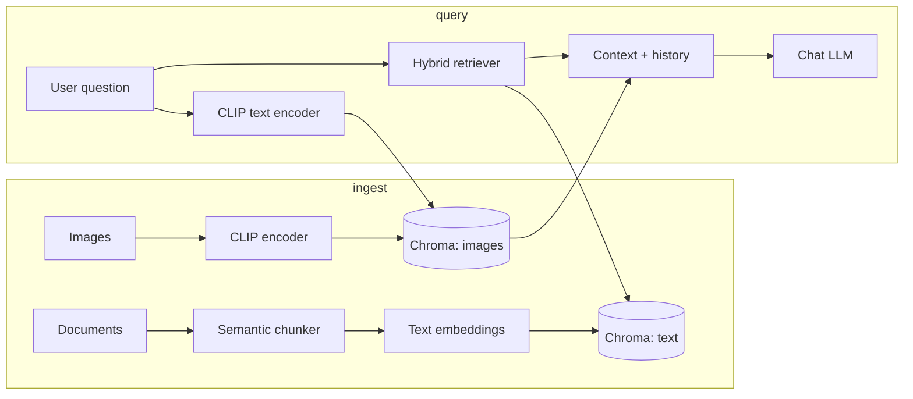

# Advanced Multimodal RAG

A complete Retrieval-Augmented Generation (RAG) system with:

- **Ingestion + indexing pipeline** (documents/images → chunk → embed → store)
- **Retrieval pipeline** (hybrid dense + lexical + optional CLIP image retrieval)
- **History-aware chat** (conversation context improves follow-up answers)
- **Streamlit UI** (simple interaction + source inspection)

Core flow: **ingest → chunk → embed → store → retrieve → generate**.

## What makes this project “complete”

1. **Semantic chunking (not character-based)**
   - Splits by sentence boundaries and decides chunk breaks using embedding cosine-similarity drops.
2. **Hybrid retrieval**
   - Merges **dense** semantic search (Chroma) and **lexical** BM25 using **weighted Reciprocal Rank Fusion (RRF)**.
3. **History-aware chat**
   - Keeps the last `MAX_HISTORY_TURNS` user/assistant pairs and includes them in the prompt.
4. **Optional multimodal support (images)**
   - Uses CLIP embeddings to retrieve visually related images from a separate Chroma collection.
5. **Instructor-friendly UI**
   - Streamlit lets you upload files, index them, ask questions, and inspect retrieved sources.

## Setup

```powershell
python -m venv venv
.\venv\Scripts\Activate.ps1
pip install -r requirements.txt
```

Create `.env` in the project root (or set environment variables):

```env
OPENAI_API_KEY=sk-...
# Optional overrides:
# OPENAI_MODEL=gpt-4o-mini
# EMBEDDING_MODEL=sentence-transformers/all-MiniLM-L6-v2
# CLIP_MODEL=clip-ViT-B-32
# VECTOR_DB_DIR=vectorstore/chroma
#
# Optional (hide Hugging Face cache warning):
# HF_HUB_DISABLE_SYMLINKS_WARNING=1
```

## Run the app (Streamlit)

### PowerShell (recommended)

From the repository root:

```powershell
.\venv\Scripts\python.exe -m streamlit run app/app.py
```

### VS Code-friendly entrypoint

This repo includes a clean `main.py` entrypoint that starts the Streamlit UI (useful for VS Code “Run”):

```powershell
.\venv\Scripts\python.exe main.py
```

Or:

```powershell
.\run_app.ps1
```

## CLI ingest (optional)

You can ingest/index text into Chroma without the UI:

```powershell
.\venv\Scripts\python.exe scripts\ingest.py path\to\doc.pdf
```

Then use the same Chroma persist directory when running the UI (defaults to `vectorstore/chroma`).

## Terminal demo (no LLM calls, great for presentations)

This prints **(1) semantic chunking results** and **(2) top retrieved chunks** using hybrid retrieval—without calling the OpenAI model.

```powershell
.\venv\Scripts\python.exe scripts\demo_retrieve.py `
  --doc data\raw\sample.txt `
  --question "What does the RAG pipeline do?" `
  --k 3
```

## Architecture



## Key modules (what each one does)

- `config.py`
  - Central config (model names, chunking thresholds, retrieval settings, chat history size, Chroma persist path).
- `ingestion/loader.py`
  - Loads PDF/TXT/MD and attaches metadata (`source`, `page`).
  - Converts images into `Document`s with captions for downstream prompting.
- `ingestion/chunker.py`
  - Semantic chunking algorithm:
    - Sentence tokenize text.
    - Embed sentences.
    - Start a new chunk when similarity between adjacent sentences drops below the threshold.
  - Adds `chunk_index` metadata.
- `ingestion/embedder.py`
  - Dense text embeddings for the text index.
  - CLIP encoders for optional image retrieval.
- `ingestion/vector_db.py`
  - Persists two Chroma collections:
    - `rag_text` for text chunks
    - `rag_images` for CLIP embeddings
  - Provides CLIP image querying.
- `retrieval/hybrid.py`
  - Weighted **RRF** that merges dense results and BM25 results.
- `chat/memory.py`
  - Keeps the last `MAX_HISTORY_TURNS` user/assistant turns.
- `generation/prompt.py`
  - Grounds the model on retrieved context and requests bracket-style citations.
- `chat/rag_chain.py`
  - One chat turn orchestration:
    - retrieve context (text + optional images)
    - build messages with history
    - call the OpenAI chat model
- `app/app.py`
  - Streamlit UI: upload → index → chat → show sources.

## Demo script for your instructor (what to show)

### Show the indexing pipeline
1. Open the app.
2. Upload a PDF/TXT/MD in the sidebar.
3. Click **Index uploaded files**.
4. Confirm that the sidebar reports indexed chunks.

### Show semantic chunking + retrieval transparency
1. Ask: “What does the RAG pipeline do end-to-end?”
2. Expand **Sources (text)**.
3. Point out that the answer is grounded by retrieved chunks (with `source` and optional PDF page).

### Show hybrid retrieval behavior
1. Toggle **Hybrid search (dense + BM25)**.
2. Change dense-vs-BM25 weight slider slightly.
3. Re-ask the same question and note that retrieved sources can shift.

### Show history-aware chat
1. Ask a follow-up like: “Now summarize it in 3 steps based on what we discussed.”
2. Explain that the prompt includes the last `MAX_HISTORY_TURNS` conversation turns.

### Optional: show multimodal retrieval
1. Upload images (topic-related with the text).
2. Click **Index uploaded files** again.
3. Ask: “Which parts of the document relate to these images?”
4. Expand **Sources (images)** and show the CLIP-selected thumbnails.

## Notes / expected console messages

- First model download (MiniLM, CLIP) can take a few minutes.
- Image “context” is captions: the LLM receives caption text retrieved by CLIP similarity, and the UI displays the matched thumbnails.

### Console messages you might see

| Message | Meaning |
|--------|---------|
| **Local URL / Network URL** | Normal: open the Local URL in your browser. |
| **Unauthenticated requests to the HF Hub** | Optional: set `HF_TOKEN` in `.env` for higher rate limits. |
| **BertModel LOAD REPORT … UNEXPECTED (position_ids)** | Harmless note from `sentence-transformers`; safe to ignore. |
| **Symlinks … Windows** | Harmless cache warning; set `HF_HUB_DISABLE_SYMLINKS_WARNING=1` to hide it. |
| **MiniLM loads twice** | Expected: semantic chunker and text embedder may load the same model during first indexing. |
